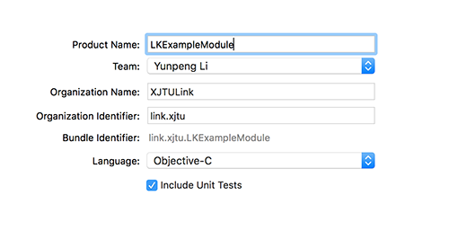
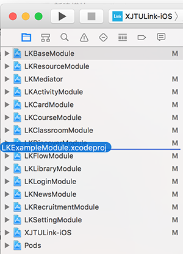

#### 模块原则

功能相对独立，与其他模块没有过多依赖

LKBaseModule + LKMediator + 模块 = 独立App


#### 命名规则

正常情况下以LK为前缀，Module为后缀


#### 一、新建模块工程

1. 使用Xcode创建一个新工程，选择`Cocoa Touch Framework`

2. 工程配置如下，注意替换工程名

   

3. 注意工程目录，应放在`XJTULink-iOS/XJTULink-iOS`目录下

4. 删除`LK****Module.h`文件

5. 创建目录`ViewModel`、`Model`、`View`、`Category`、`Public`，注意目录对应Group

6. 拖动`LK****Module.xcodeproj`至workspace





#### 二、将工程引入CocoaPods管理

##### 1. 进入对应工程目录创建podsspec文件(注意替换星号)


```
Pod::Spec.new do |s|
  s.name         = "LK****Module"
  s.version      = "1.0.0"
  s.summary      = "模块名（中文）"

  s.description  = <<-DESC
  这里写关于模块的描述
                   DESC

  s.homepage     = "http://git.oschina.net/xjtulink/XJTULink-iOS"
  s.license      = "MIT"
  s.author       = { "姓名" => "邮箱" }
  s.source       = { :git => "https://git.oschina.net/xjtulink/XJTULink-iOS.git", :tag => "#{s.version}" }

  s.source_files  = '**Module/**/*.{h,m}'
  s.resources = "**Module/**/*.{xib, storyboard}", "**Module/**/*.plist"
  s.ios.exclude_files = '**Tests/*', '**/Info.plist'
  
  s.requires_arc = true
  s.ios.deployment_target = "9.0"

  s.dependency 'LKBaseModule'
  s.dependency 'LKResourceModule'

end
```

**参数含义**

`s.name`  模块名（英文）

`s.summary` 模块简述（模块名）

`s.description `模块相关描述

` s.author` 姓名/邮箱

`s.source_files` 源码目录（注意如果不是Module为后缀的工程需要修改）

`s.resources`资源目录（工程里用到的任何资源文件xib、storyboard、plist、图片等都需要在这里引入，否则最终找不到资源，建议图片统一放在LKResourceModule）

`s.ios.deployment_target`iOS最低版本

`s.dependency`依赖关系，如果有依赖其他模块，需要在这里添加依赖关系

##### 2. 修改Profile文件

在`target 'XJTULink-iOS' do`下添加

```
pod 'LK****Module',     :path => './XJTULink-iOS/LK****Module
```

在Profile文件后添加新的target(**注意替换星号**)

```
target 'LK****Module' do
    project './XJTULink-iOS/LK****Module/LK****Module.xcodeproj'
end
```
##### 3. 执行`pod install`，重新打开workspace即可